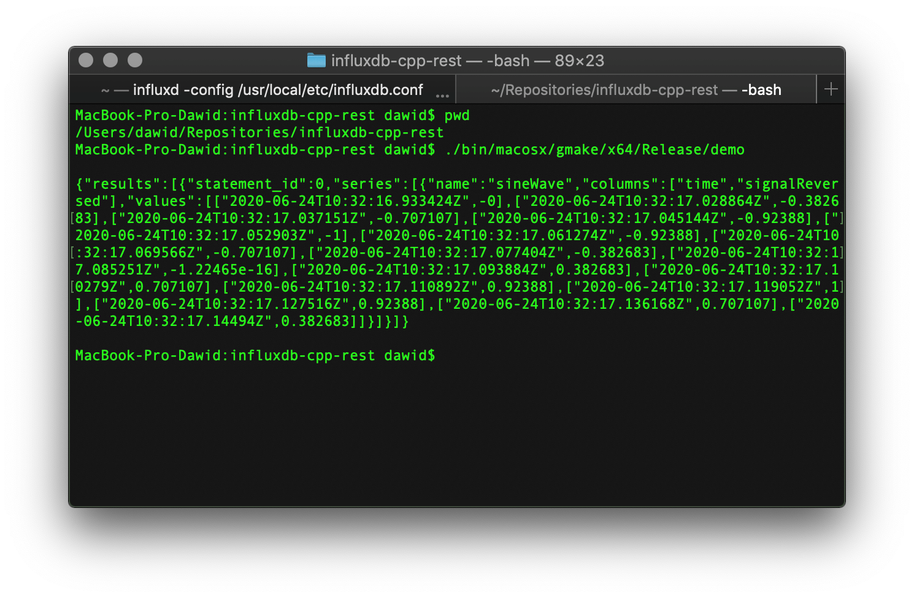

## Info
I made changes to the influxdb-cpp-rest demo app to show how to store and retrieve sine wave.

## Build and test 
Assuming cpprestsdk is installed (`brew install cpprestsdk`):
`make -C build/<PLATFORM>/gmake/ config=<CONFIGURATION>`

For example, on macOS that would be:
`make -C build/macosx/gmake/ config=release_x64;`

To run the app type: 
`./bin/<PLATFORM>/gmake/<CONFIGURATION>/demo`

Assuming macOS platform and x64 Release configuration the binaries can be executed as follows:
`./bin/macosx/gmake/x64/Release/demo`

## Example

